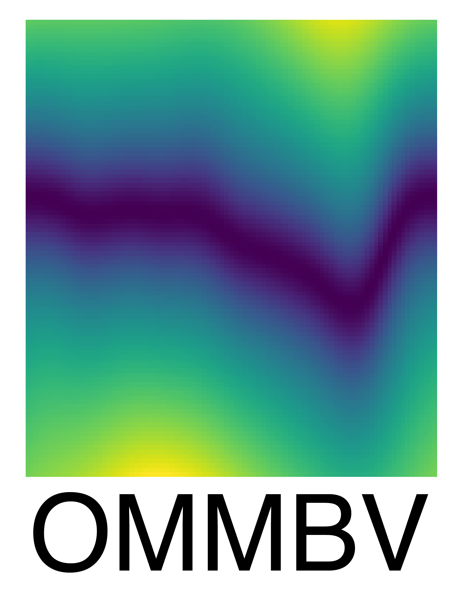

        
        

# Orthogonal Multipole Magnetic Basis Vectors (OMMBV)

The motion of plasma in the ionosphere is the result of forcing from neutral 
winds, electric fields, as well as the orientation of those fields and forces
relative to the background magnetic field. OMMBV (Orthogonal Multipole 
Magnetic Basis Vectors) calculates directions (unit vectors) based upon the 
geomagnetic field that are optimized for understanding the movement of plasma,
the mapping of electric fields, and coupling with the neutral atmosphere. 
This system is the first to remain orthogonal for multipole magnetic fields
as well as when including a geodetic reference surface (Earth). 
 
OMMBV also includes methods for scaling ion drifts and electric fields 
at one location to any other location along the same field line, though
typically the mapping is either the magnetic footpoint or to the 
magnetic equator. Scaling to the footpoint is critical for understanding 
how neutral atmosphere winds at low altitudes (120 km for coupling with
E-region ionosphere) will be 
expressed either at the satellite location or at the magnetic equator. 
Scaling to the magnetic equator can be particularly effective when creating a 
common basis for integrating measurements from multiple platforms as
the scaling reduces a 4-dimensional data distribution (local time,
longitude, latitude, altitude) down to three (local time,
longitude, apex height). This feature may also be used by numerical models
to reduce memory requirements and runtime. Calculations may be performed
at the magnetic equator and then mapped throughout the magnetosphere, as needed.

OMMBV is used by the NASA Ionospheric Connections (ICON) Explorer 
Mission to understand how remote measurements of neutral motions at 120 km 
impacts the motion of plasma measured in-situ (at the satellite location). 
This package is also being used by the NOAA/NSPO COSMIC-2 
constellation to express plasma measurements made at the satellite locations 
in a more geophysically useful basis. OMMBV is currently being incorporated 
into analysis routines suitable for integrating physics-based models (TIEGCM) 
and measurements from the Communications/Navigation Outage Forecasting System 
(C/NOFS) satellite.

The development of the multipole software has been supported, in part, by 
multiple agencies under the following grants:
Naval Research Laboratory N00173-19-1-G016 and NASA 80NSSC18K1203.

Previous versions of this software that provided an 'average' basis were 
funded by: National Aeronautics and Space Agency (NASA NNG12FA45C), 
National Oceanic and Atmospheric Administration (NOAA NSF AGS-1033112), 
and the National Science Foundation (NSF 1651393).

# Performance
OMMBV is able to characterize its uncertainty in determining an accurate
vector basis. There are two potential calculation paths within OMMBV. The 
default path uses information from the calculated zonal vector and field-aligned
vector to obtain the corresponding meridional vector. Alternately, OMMBV can
calculate the meridional vector and obtain the corresponding zonal vector.
If the magnetic field has an underlying orthogonal vector basis, and if
OMMBV is operating correctly, OMMBV's two calculation paths will 
yield the same result. 

The figures linked below provide direct numerical evidence that OMMBV is calculating
a valid orthogonal vector basis. OMMBV's normalized uncertainty 
when applied to a [pure dipole magnetic field with a spherical Earth](docs/images/dipole_uncertainty.png), and
the uncertainty when [applied to the Earth](docs/images/igrf_uncertainty.png) using the
[International Geomagnetic Reference Field](https://geomag.bgs.ac.uk/research/modelling/IGRF.html),
are effectively the same. Both systems have an expected maximum uncertainty
of around 0.0001% between +/- 50 degrees latitude. Both figures are calculated
at an altitude of 550 km and use an OMMBV calculation step size of 5 km.
The default step size for OMMBV and IGRF is 0.5 km which offers improved 
performance.

# Geomagnetic Unit Vectors
Plasma in the ionosphere is constrained by the geomagnetic field. Motion 
along magnetic field lines is easy while motion across field lines is 
comparatively hard. To understand the motion of ions it is generally 
best to do so along these directions.

 - Field Aligned: Along the geomagnetic field, pointing generally from south 
to north at the equator.

 - Zonal: Perpendicular to the field aligned vector and points to a 
neighboring field line that has no change in apex height at the geomagnetic
equator.

 - Meridional: Perpendicular to the zonal and field aligned directions. 
This vector is positive upward and is vertical at the geomagnetic equator. 
To remain perpendicular to the field, the meridional vector has a poleward 
component when away from the magnetic equator. Note that meridional may 
sometimes be used in other contexts to be north/south. Here, the vector 
is generally up/down.

# Electric Field and Ion Drift Mapping
OMMBV provides scalars for mapping ion motions or electric fields
expressed along geomagnetic unit vectors to other locations along the
same field line, though typically the scaling is to either the 
magnetic footpoint or to the magnetic equator. 
These scalars are determined assuming that magnetic 
field lines are equipotential, thus the electric field associated with 
ion motion will vary as the distance between two geomagnetic field lines 
changes. Note that there is no mixing of 'zonal' or 'meridional' directions
when mapping along a field line. While the orientation for both directions
varies along a field line, the zonal and meridional directions are always
orthogonal.

# Field-Line Tracing
OMMBV uses the apex locations of field lines to determine both the unit vectors
as well as the mapping vectors for both ion drifts and electric fields.
To determine the apex location of field lines, the International Geomagnetic 
Reference Field (IGRF) is coupled into SciPy's odeint to produce an 
accurate field line tracing algorithm. The SciPy integrator is an adaptive
method that internally determines an appropriate step size thus the 
performance of the technique is both robust and accurate. The sensitivity 
of the field line tracing and other quantities in this package have been 
established via direct comparison (when possible) as well as sensitivity 
and consistency tests.

# Coordinate Transformations
Supports the conversion of geographic and geodetic (WGS84) into each other 
and into Earth Centered Earth Fixed (ECEF). ECEF coordinates are fixed with 
respect to the Earth, x points from the center towards 0 degrees longitude 
at the geographic equator, y similarly points to 90 degrees east, while z 
points along the Earth's rotation axis.

# Vector Transformations
Supports expressing a vector known in one basis into the same vector 
expressed in another basis. This supports translating measurements made in a 
spacecraft frame into frames more relevant for scientific analysis.
