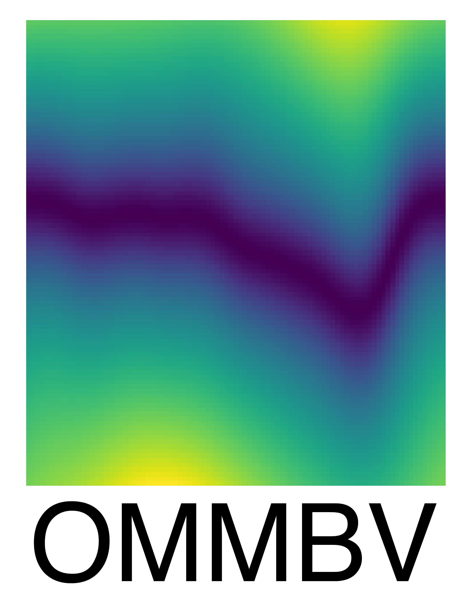

.. _overview:

Overview
========

The derivation of an appropriate vector basis has been a long-term challenge
in space science. The vector basis in current use is non-orthogonal and as
such presents a number of challenges when attempting to apply it to space
science studies. This package provides for the calculation of an orthogonal
vector basis, consistent with the underlying physics, for general magnetic
fields. Further, OMMBV calculates scaling factors suitable for translating
an electric field at one location to any other location on the field line.
OMMBV retains these properties for non-spherical planets, such as the Earth, as
well as for magnetic fields that are more complicated than a pure dipole, such
as the Earth's.

These features are fundamental for Space Science studies. Satellite measurements
of plasma motions in-situ can now be accurately mapped along field lines
for comparison to ground based equipment. Forcings from the neutral atmosphere
(in say Earth's E-region Ionosphere) may now also be mapped to satellite
altitudes to accurately characterize both the magnitude and direction
of that forcing on plasma motion at satellite locations. Computer modelers
may use OMMBV to map electric fields calculated within a single plane through
the whole magnetosphere, significantly reducing computational resources.

OMMBV has been validated using a variety of test magnetic sources as well as
via application to the Earth's magnetic field using the
`International Geomagnetic Reference Field (IGRF) <https://geomag.bgs.ac.uk/research/modelling/IGRF.html>`_.
Further, OMMBV includes two paths to determine the relevant vector basis. Both
paths will only result in the same answers if the underlying system is truly
orthogonal. The statistical performance of OMMBV between IGRF with a geodetic
Earth and a spherical Earth with a pure dipole magnetic field is the same.
OMMBV vectors are accurate up to 6-7 digits of precision at default calculation
settings.

